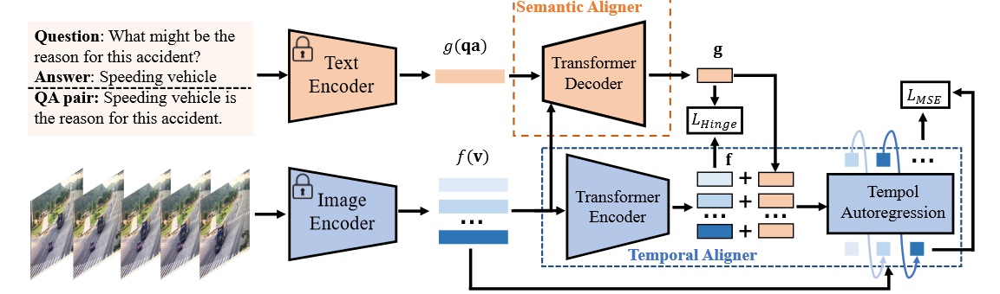

# Tem-adapter: Adapting Image-Text Pretraining for Video Question Answer

This repository contains PyTorch implementation for ICCV2023 paper __Tem-adapter: Adapting Image-Text Pretraining for Video Question Answer__ [[arXiv]](https://arxiv.org/pdf/2308.08414v1.pdf)


[](https://paperswithcode.com/sota/video-question-answering-on-sutd-trafficqa?p=tem-adapter-adapting-image-text-pretraining)


We propose Tem-Adapter, which enables the learning of temporal dynamics and complex semantics by a visual Temporal Aligner and a textual Semantic Aligner. Tem-adapter introduces a language-guided autoregressive task to guide the learning of temporal dependency and thus reduce the temporal gap between image-based pre-training and video-based QA tasks.





## Environment Setup

1. Install PyTorch (should install [miniconda](https://docs.conda.io/en/latest/miniconda.html) first):

```bash
conda create --name myenv python=3.7
conda activate myenv
conda install pytorch==1.8.0 torchvision==0.9.0 torchaudio==0.8.0 cudatoolkit=10.2 -c pytorch
```

2. Install dependencies 

```bash
conda install -c conda-forge ffmpeg
conda install -c conda-forge scikit-video
pip install ftfy regex tqdm
pip install timm
pip install jsonlines
pip install git+https://github.com/openai/CLIP.git
pip install -r requirements.txt
```

## Download the dataset and Pre-process with CLIP visual encoder

The SUTD-TrafficQA dataset is publicly released. You can download the original videos and text annotations from https://sutdcv.github.io/SUTD-TrafficQA/#/explore

You can use OpenAI's CLIP as the pre-trained image encoder (ViT-B32). The following instructions can be followed.

1. Create a folder `./data/` in current directory, such as:
```
Tem-adapter/
|–– configs/
|–– data/
|–– model/
|–– ...
```

2. Unzip downloaded video file 'raw_videos.zip' to 'data' as `./data/raw_videos/`.

3. Put the downloaded annotation file 'R3_all.jsonl' to 'data' as `./data/annotation_file/R3_all.jsonl`.


The directory should have the following structure:

```
Tem-adapter/
|–– configs/
|–– data/
|   |–– raw_videos
|       |–– b_1a4411B7sb_clip_005.mp4
|       |–– b_1a4411B7sb_clip_006.mp4
|       |__ ...  
|   |-- annotation_file
|       |–– R3_all.jsonl
|–– model/
|–– ...
```

4. Run the following command to extract features with the CLIP visual encoder.

```bash
python preprocess/preprocess_features.py --gpu_id 0 --dataset sutd-traffic --model clip_image 
```
Then there will be a new folder `./data/sutd-traffic/` under the current path.


5. Download the texts (QA pairs) from [here](https://drive.google.com/drive/folders/1NgfWg6MBD_LYGBXlJqUtlZ52ZEivFSKE?usp=sharing) and put them under the path `./data/sutd-traffic/` 

The dataset directory should have the following structure:

```
Tem-adapter/
|–– configs/
|–– data/
|   |–– raw_videos
|       |–– b_1a4411B7sb_clip_005.mp4
|       |–– b_1a4411B7sb_clip_006.mp4
|       |__ ...
|   |-- annotation_file
|       |–– R3_all.jsonl
|   |-- sutd-traffic
|       |–– sutd-traffic_transition_appearance_feat.h5
|       |–– output_file_train.jsonl
|       |–– output_file_test.jsonl
|–– model/
|–– ...
```

## Evaluate the trained model

1. Create a new folder "pretrained" under the path 'Tem-adapter/'

2. Download the trained checkpoints from this [link](https://drive.google.com/drive/folders/1SplEKEjrp-Uw-PxziyBHvUuU-yQ0YevX?usp=sharing) and put them under the path 'Tem-adapter/pretrained/'


The directory should have the following structure:

```
Tem-adapter/
|–– configs/
|–– data/
|   |–– raw_videos
|       |–– b_1a4411B7sb_clip_005.mp4
|       |–– b_1a4411B7sb_clip_006.mp4
|       |__ ...
|   |-- annotation_file
|       |–– R3_all.jsonl
|   |-- sutd-traffic
|       |–– sutd-traffic_transition_appearance_feat.h5
|       |–– output_file_train.jsonl
|       |–– output_file_test.jsonl
|–– model/
|–– pretrained
    |-- semanticaligner_49.pt
    |-- tempaligner_49.pt
|–– ...
```

3. Uncomment related lines in the 'validate.py' (Check the file for further reference).

4. To evaluate the trained model, run the following command:

```bash
python validate.py --cfg configs/sutd-traffic_transition.yml
```


## Training

Choose the config file in 'configs/sutd-traffic_transition.yml', run the following command:

```bash
python train.py --cfg configs/sutd-traffic_transition.yml
```


## Evaluation

To evaluate the trained model, run the following:

```bash
python validate.py --cfg configs/sutd-traffic_transition.yml
```


## License
MIT License

## Citation
If you find our work useful in your research, please consider citing:
```
@inproceedings{chen2023tem,
  title={Tem-adapter: Adapting Image-Text Pretraining for Video Question Answer},
  author={Chen, Guangyi and Liu, Xiao and Wang, Guangrun and Zhang, Kun and Torr, Philip HS and Zhang, Xiao-Ping and Tang, Yansong},
  booktitle={Proceedings of the IEEE/CVF International Conference on Computer Vision},
  pages={13945--13955},
  year={2023}
}
```

## Acknowledgement
Our reproduction of the methods is mainly based on the [SUTD-TrafficQA](https://github.com/SUTDCV/SUTD-TrafficQA) and [HCRN-VideoQA](https://github.com/thaolmk54/hcrn-videoqa), we thank the authors to release their codes. 

